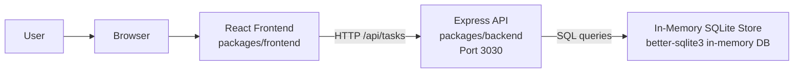

# Cloud Architecture Overview

## Summary

This monorepo is a simple three-tier web application with a React frontend, an Express API, and
an in-memory data store. The frontend runs in the browser, sends HTTP requests to the backend API,
and the backend reads and writes task data in an in-memory SQLite database.

The architecture is intentionally lightweight:

- `packages/frontend` contains the React application.
- `packages/backend` contains the Express API.
- The frontend development server proxies `/api` requests to the backend on port `3030`.
- Data is not persisted outside the running backend process.

## System Context Diagram

## Component Responsibilities

### React Frontend

- Renders the task creation and task list user interface.
- Sends create and update requests to `/api/tasks`.
- Uses the frontend dev server proxy to reach the backend during local development.
- Holds UI state such as the current task being edited and refresh triggers.

### Express API

- Exposes REST endpoints under `/api/tasks` for listing, creating, updating, toggling, and
  deleting tasks.
- Applies request parsing, CORS, and request logging middleware.
- Acts as the only service that reads from or writes to the data store.

### In-Memory Store

- Uses SQLite in memory through `better-sqlite3`.
- Stores task records for the lifetime of the backend process only.
- Resets when the backend restarts.

## Runtime Notes

- The root workspace starts frontend and backend together with concurrent scripts.
- The backend listens on port `3030` by default.
- The frontend package is configured to proxy API traffic to `http://localhost:3030`.
- Because storage is in memory, this setup is appropriate for local development, demos, and
  bootcamp exercises rather than durable production use.